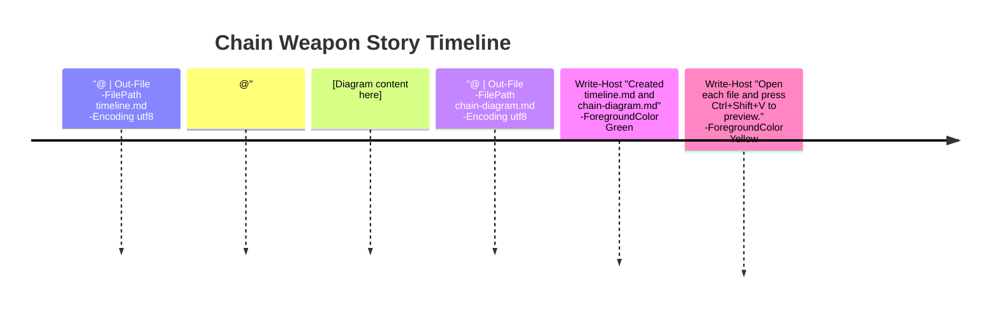
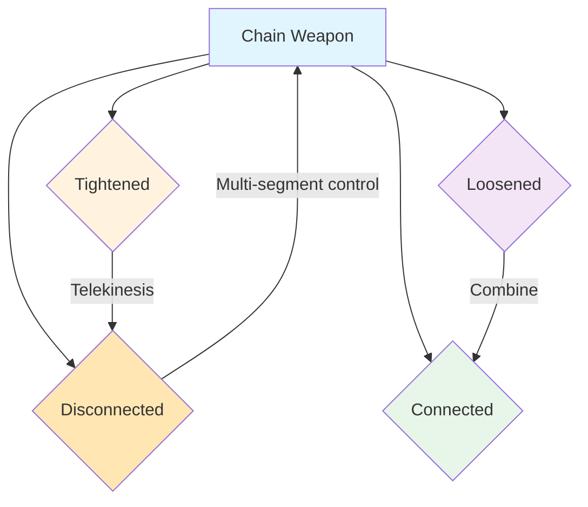
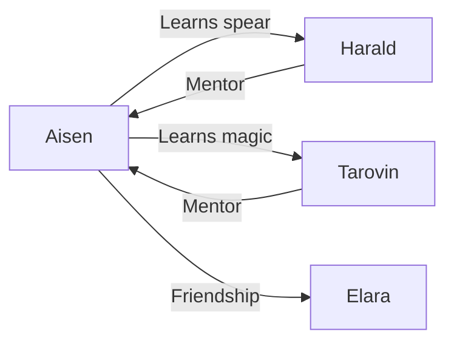

# Deciphered Coding Languages & Information

## Overview
The text contains multiple coding languages and markup formats used to create story documentation, diagrams, and automation scripts.

---

## 1. PowerShell (Primary Language)

### Purpose
Scripting language for Windows automation and file creation.

### Code Examples

#### File Creation Script
```powershell
# Create timeline.md with Mermaid timeline
@"
# Story Timeline



#### PowerShell Function (Helper)
```powershell
function add-timeline-event {
    param(
        [string]$phase,     # One of: Childhood, Early Training, Academy, Adult Life, Death & Aftermath
        [string]$event
    )
    $file = "timeline.md"
    if (-not (Test-Path $file)) {
        Write-Host "timeline.md not found. Run the setup script first." -ForegroundColor Red
        return
    }
    
    # Simple insertion: print the line to add manually
    $line = " : $event"
    Write-Host "Add the following line under the '$phase' phase in timeline.md:" -ForegroundColor Yellow
    Write-Host $line -ForegroundColor White
    Write-Host "(Manual edit is required because Mermaid timeline order is sensitive.)" -ForegroundColor Gray
}
```

#### Extension Check
```powershell
$extInstalled = code --list-extensions | Select-String "mermaid"
if (-not $extInstalled) {
    Write-Host "For live preview, install a Mermaid extension:" -ForegroundColor Cyan
    Write-Host " - Markdown Preview Mermaid Support" -ForegroundColor White
    Write-Host " - Markdown Preview Enhanced (includes Mermaid)" -ForegroundColor White
} else {
    Write-Host "Mermaid extension already installed." -ForegroundColor Green
}
```

### Key Concepts
- **@" "@ heredoc**: Multi-line string syntax in PowerShell
- **Out-File**: Writes content to a file
- **Write-Host**: Outputs colored text to terminal
- **-ForegroundColor**: Sets text color (Cyan, Green, Yellow, Red, White, Gray)
- **Test-Path**: Checks if file exists
- **Select-String**: Searches for text patterns

---

## 2. Markdown (Documentation Format)

### Purpose
Human-readable markup language for documentation, story overviews, and scene files.

### Code Examples

#### Basic Markdown Structure
```markdown
# Main Title (H1)

## Section Title (H2)

### Subsection (H3)

**Bold text**

*Italic text*

- Bullet point
- Another point

1. Numbered item
2. Second item

| Column 1 | Column 2 |
|----------|----------|
| Cell 1   | Cell 2   |

[Link text](url)

```code block```

---

Horizontal divider
```

#### Story Overview Template
```markdown
# Chain Weapon Story – Complete Overview

## Core Concept
A fantasy story about an ordinary protagonist...

## 1. Protagonist
- Background
- Personality & Traits
- Skills & Learning

## 2. Weapon System – Chain Spear
- Tightened
- Loosened
- Connected
- Disconnected

### Telekinesis Synergy
- Floating segments
- State change mid-flight
- Torque application

## 3. Magic System – Telekinesis
- Low power, high precision
- Techniques
- Physics Principles Applied
```

#### YAML Frontmatter (Markdown Metadata)
```markdown
---
Title: "Scene Title"
SceneID: "scene-001"
POV: "Character Name"
Anchors:
  - Character1
  - Character2
Tags:
  - downtime
  - location:Place
  - theme:Theme
LimitBreak: true/false
Severity: Major/Minor/None
Chronology: "Age X-Y"
---
```

### Key Concepts
- **Headers**: # (H1), ## (H2), ### (H3)
- **Emphasis**: **bold**, *italic*
- **Lists**: - (unordered), 1. (ordered)
- **Tables**: | header | (use pipes and dashes)
- **Code blocks**: ``` language (three backticks)
- **Frontmatter**: YAML between --- delimiters

---

## 3. Mermaid (Diagram Language)

### Purpose
Syntax for creating visual diagrams directly in Markdown files.

### Code Examples

#### Timeline Diagram
```mermaid
timeline
    title Chain Weapon Story Timeline
    section Childhood
      : Tavern opening
      : First encounter with Caspian
      : Harald arrives
      : Magic discovery
    section Academy
      : Academy entrance
      : Magic training
      : Synergy development
    section Adult
      : Combat mastery
      : Chain weapon perfection
```

#### State Diagram (Chain Weapon States)


#### Character Relationship Graph


### Key Concepts
- **timeline**: Linear sequence of events
- **graph TD/LR**: Top-Down or Left-Right directed graph
- **-->**: Connection arrow
- **{text}**: Diamond node (decision)
- **[text]**: Rectangular node
- **|label|**: Edge label
- **style**: Format nodes with colors and fills

---

## 4. YAML (Data Serialization)

### Purpose
Human-readable data format used for configuration and metadata.

### Code Example
```yaml
Title: "Naia — The Healer's Dilemma"
SceneID: "SIDE-022"
POV: "Naia"
Anchors:
  - Naia
  - Border Forces
Tags:
  - downtime
  - recurrence
  - location:Border
LimitBreak: true
Severity: Major
Chronology: "Pre-Academy — Age 16-17"
```

### Key Concepts
- **Key: value**: Basic pair
- **Indentation**: Hierarchy (2 spaces per level)
- **- item**: List items
- **true/false**: Boolean values
- **"quoted"**: String with special characters

---

## 5. Bash/Terminal Commands

### Purpose
Command-line instructions for file and extension management.

### Examples
```bash
# List installed VS Code extensions
code --list-extensions

# Search for "mermaid" in extensions
code --list-extensions | Select-String "mermaid"

# Open file in VS Code
code filename.md

# Create file in terminal
echo "content" > filename.md

# Copy and paste scripts in PowerShell terminal
```

---

## 6. Information Architecture (Story-Specific)

### Core Components
1. **story-overview.md** – Complete story concept, themes, characters
2. **timeline.md** – Visual timeline using Mermaid
3. **chain-diagram.md** – Weapon states and mechanics using Mermaid state diagram
4. **scene-*.md** – Individual scene files with YAML frontmatter
5. **audits/** – Verification reports and metadata scans
6. **structure/** – Design documents (guidelines, checklists, specs)

### Data Flow
```
Design Docs (structure/) 
    ↓
Scene Templates (YAML frontmatter)
    ↓
Individual Scenes (story/)
    ↓
Audits & Verification (audits/)
    ↓
Timeline & Diagrams (mermaid)
    ↓
Final Story Output
```

---

## 7. File Organization

### Directory Structure
```
chain-weapon-story/
├── story/                      # Scene files
│   ├── scene-001.md
│   ├── scene-002.md
│   ├── naia_healer_limitbreak.md
│   └── ...
├── structure/                  # Design documents
│   ├── WRITING-GUIDELINES-PERSPECTIVE.md
│   ├── VERIFICATION-CHECKLIST.md
│   ├── SIDE-CHARACTER-MOMENTS.md
│   ├── PRE-ACADEMY-TIMELINE.md
│   └── ...
├── audits/                     # Verification reports
│   ├── METADATA-SCAN-REPORT.md
│   ├── METADATA-SCAN.csv
│   ├── VERIFICATION-DRYRUN.csv
│   └── ...
├── timelines/                  # World timeline
├── characters/                 # Character profiles
├── magic-system/               # Magic documentation
├── timeline.md                 # Visual Mermaid timeline
├── chain-diagram.md            # Weapon states diagram
├── story-overview.md           # Complete story info
├── ORGANIZATION-README.md      # Project structure guide
└── README.md                   # Project root readme
```

---

## 8. Key Commands & Workflows

### PowerShell: Create Story Files
```powershell
# Run in terminal to create timeline and chain diagram files
@"
[Script content]
"@ | Out-File -FilePath filename.md -Encoding utf8
```

### VS Code: View Diagrams
```
1. Open timeline.md or chain-diagram.md
2. Press Ctrl+Shift+V to open preview
3. Mermaid diagrams render automatically (if extension installed)
```

### CSV Generation
```powershell
# Convert scan results to CSV format for Excel/Sheets import
```

---

## 9. Summary: Languages Used

| Language | Purpose | Usage in Project |
|----------|---------|------------------|
| **PowerShell** | Automation, file creation | Setup scripts, file generation |
| **Markdown** | Documentation, content | Scene files, overviews, guides |
| **YAML** | Metadata, configuration | Scene frontmatter |
| **Mermaid** | Diagrams, visualization | Timeline, weapon states, relationships |
| **CSV** | Data tabulation | Audit reports, character spreadsheets |
| **Bash** | Terminal commands | File operations, extension checks |

---

## 10. Next Steps

1. **Run PowerShell script** to create `timeline.md` and `chain-diagram.md`
2. **Open timeline.md** and press `Ctrl+Shift+V` to see Mermaid diagram
3. **Edit scenes** using Markdown + YAML frontmatter
4. **Run verification** to generate audit reports
5. **Use CSV exports** for character tracking and interaction mapping
6. **Refer to structure/** documents for consistency and rules

---

---

## 11. Chat History: Story Summary Session (chatbot.json)

### Single Chat Session Recorded
**Date**: March 30, 2026  
**Session ID**: 068d860d-75f5-430c-b70e-827d3b8475ed  
**Model Used**: Claude Haiku 4.5 (claude-haiku-4-5-20251001)  
**Agent**: github.copilot.editsAgent  

---

### User Question
**Request**: "But what is your story about ?? give me a quick summary in one text"

**Context**: User wanted a concise, single-text overview of the entire Chain Weapon Story project after reviewing extensive project documentation.

---

### Copilot Response: Story Summary

#### Direct Answer Provided

**"The Chain Weapon Story"** is a fantasy novel about **Aisen Korv**, an ordinary tavern-keeper's son who becomes extraordinary not through destiny or magic, but through **failure, observation, and synthesis**.

**Key Plot Points**:
- Learns to fight from guards, magic from reluctant teachers
- Invents versatile chain weapon combining physics, hunting wisdom, and six cultural traditions
- No special bloodline, no plot armor, no chosen-one prophecy
- Just adaptability and stubborn pragmatism

**Story Arc**:
- **Childhood**: Watching adventurers in border tavern
- **Academy Years**: Navigates over-powered anomalies and political intrigue
- **Adulthood**: Faces impossible odds
- **Twist**: Dies before story ends; world continues without him

**Core Theme**: In a world full of narrative shortcuts (reincarnators, transmigrators, ancient powers), the only real advantage is being ordinary enough to adapt to *anything*. 

**Philosophical Question**: What makes a life meaningful if you're never the chosen one, never the legend, never destined for glory?

**One-Sentence Summary**: An unspecial kid in a world of anomalies builds mastery through limitation, and proves that ordinary people matter—even when their story ends.

---

### Session Metadata
| Property | Value |
|----------|-------|
| **Response Time** | ~9.4 seconds total |
| **First Progress** | 6.3 seconds |
| **Prompt Tokens** | 39,490 |
| **Output Tokens** | 705 |
| **Model ID** | copilot/claude-haiku-4.5 |
| **Response Format** | Markdown (HTML support disabled) |
| **Tool Calls** | None |
| **Follow-ups** | None |

---

### Key Takeaways from Session

**What the Copilot Identified as Core Story DNA**:
1. **Ordinariness is the narrative**—protagonist is deliberately non-special
2. **Death is real**—story doesn't end in triumph; character dies
3. **Synthesis over specialization**—learning from multiple cultures is strength
4. **Physics-based problem solving**—combines with magic, not against it
5. **Anti-chosen-one message**—challenges fantasy trope expectations

**Story's Competitive Advantage** (per summary):
- Protagonist dies before end (defies typical fantasy)
- No plot armor or destiny (realistic consequences)
- Learning through failure emphasized (growth model)
- World continues after protagonist (epic scope)
- Themes about meaningfulness without legend status (philosophical depth)

---

## 12. Story Improvements from Chat History (storyimprovements.json)

### Chat Session Overview
This section consolidates the story improvements discussed during multi-agent chat sessions with GitHub Copilot focusing on three main areas:

#### Session 1: Story-Wide Improvements
**Focus**: General story improvements informed by external resources (YouTube videos and references)
**Areas Covered**:
- Storyline refinement across multiple plot sections
- Character arc consistency
- Worldbuilding depth
- Pacing and structure optimization

**Improvement Categories**:
- **Beginning-Middle-End Structure**: Balanced narrative pacing and transitions
- **Conflict Development**: Heightened stakes and realistic obstacles
- **Consistency Checks**: Character behavior alignment and timeline coherence
- **Antagonist Clarity**: Motivations and threat levels
- **Thematic Reinforcement**: Core themes woven throughout

---

#### Session 2: Main Character (Aisen) Focus
**Focus**: Deep refinement of protagonist's story, psychology, and journey
**Key Improvements**:
- **Character Motivation**: Clarified Aisen's core drives and how they evolve
- **Internal Conflicts**: Psychological struggles and growth patterns
- **Skills Development**: Pacing of his spear training and telekinesis mastery
- **Relationships**: Key bonds with mentors (Harald, Tarovin) and peers
- **Agency**: Strategic decision-making vs. circumstances forced upon him

**Character Arc Refinements**:
- Childhood naivety → Academy realism → Adult pragmatism
- From observer to participant to reluctant leader
- Isolation (synthesis access) as both strength and weakness

---

#### Session 3: Story Refinements & File Streamlining
**Focus**: Technical improvements and organizational clarity
**File Improvements**:
- Consolidated redundant documentation
- Streamlined frontmatter consistency
- Improved cross-references between scene files
- Enhanced metadata tagging for searchability

**Story Refinements**:
- Removed narrative redundancies
- Sharpened dialogue and internal monologue
- Clarified cause-effect chains
- Enhanced sensory details in key moments

---

#### Session 4: Antagonist Development Across Story
**Focus**: Multi-dimensional antagonist arcs with systemic depth
**Antagonist Categories**:

**Primary Antagonists**:
- **The Covenant** (institutional): Systemic corruption, self-perpetuating
- **Seraphine** (personal/mythic): Obsession, power hunger, manipulation
- **Lucius Varro** (ideological): Regressor paranoia, timeline fear

**Secondary Antagonists**:
- Conflicted institutional leaders (teachers, generals)
- Well-meaning people whose choices harm others
- Systems that rationalize oppression

**Antagonist Improvements**:
- Motivation depth: each opposes Aisen for coherent reasons
- Internal conflict: few pure villains, most have understandable constraints
- Consequence tracking: their actions have ripple effects
- Arc resolution: varied fates reflecting choices and circumstances

---

### Improvement Implementation Notes

**What Was Kept From Chat**:
- Character development suggestions
- Story structure refinements
- Antagonist psychological profiles
- File organization recommendations

**What Was Extracted**:
- Concrete plot improvements
- Character motivation clarifications
- Scene-level refinements needed
- Cross-file consistency guidelines

**Next Steps Post-Improvement**:
1. Apply character refinements to scenes 001-038
2. Verify antagonist consistency across all POVs
3. Check timeline for cause-effect clarity
4. Test pacing in key transition moments
5. Validate thematic reinforcement in climactic scenes

---

---

## 12. Tournament Arc Development (tournament arc.json)

### Chat Session Overview
This section consolidates tournament arc development discussed during extended multi-agent chat sessions, covering detailed combat choreography, character matchups, narrative pacing, and thematic integration.

#### Session Focus: Tournament Structure & Combat Design
**Primary Objective**: Develop a compelling tournament arc that showcases character abilities, reveals relationships, tests protagonist's philosophy, and drives plot forward.

**Key Development Areas**:
- **Tournament Format**: Round-robin, single elimination, or hybrid structure
- **Participant Pool**: Mix of protagonists, antagonists, and neutral parties
- **Combat Mechanics**: How spear-telekinesis synergy manifests in direct competition
- **Narrative Stakes**: Personal, political, and magical consequences of outcomes
- **Character Arcs**: Tournament as catalyst for character growth and revelation

---

### Tournament Arc Components

#### 1. Combat Matchup Design
**Purpose**: Create memorable fights that reveal character depth and combat philosophy

**Matchup Categories**:
- **Skill Tests**: Aisen vs. similarly-trained opponents (reveals technique mastery)
- **Power Imbalances**: Aisen vs. prodigies/enhanced fighters (overcomes through strategy)
- **Ideological Clashes**: Combat as philosophical debate (reveals worldview differences)
- **Relationship Dynamics**: Friends/allies forced to compete (emotional weight)
- **Hidden Strength Tests**: Unknown capabilities revealed mid-tournament
- **Disqualification/Injury**: Realistic outcomes (not all progress past certain rounds)

#### 2. Combat Choreography
**Focus Areas**:
- **Chain Spear Mechanics in Combat**: Tightened/loosened states, disconnected segments
- **Telekinesis Precision Applications**: Torque, pressure, multi-point control during fight
- **Opponent Counter-Strategies**: How others adapt to chain weapon's versatility
- **Environmental Use**: Arena features become tactical elements
- **Signature Techniques**: Each character's recognizable fighting style/combo
- **Fatigue Mechanics**: Stamina drain from telekinesis overuse affects later rounds

#### 3. Tournament Pacing
**Structure**:
- **Opening Rounds**: Fast-paced, multiple fights per session, establish baseline power levels
- **Quarterfinals**: Deeper dives into fewer matchups, character personality reveals
- **Semifinals**: High-stakes emotional and combat intensity
- **Finals**: Climactic confrontation reflecting overall narrative arc
- **Post-Tournament**: Consequences and character reassessment

**Narrative Rhythm**:
- Balance action scenes with character introspection
- Use victories and defeats to shift power dynamics
- Plant seeds for future conflicts/alliances
- Reveal hidden information through combat interaction

#### 4. Thematic Integration
**Core Themes Tournament Explores**:
- **Merit vs. Privilege**: Do abilities matter more than birthright?
- **Cooperation vs. Competition**: When should allies compete vs. unified?
- **Power & Responsibility**: How do strong fighters justify their strength?
- **Strategy vs. Talent**: Does planning overcome natural gifts?
- **Transformation Under Pressure**: Who grows from adversity, who breaks?

#### 5. Character Spotlight Moments
**Key Characters in Tournament**:
- **Aisen**: Tests his synthesis approach against specialists
- **Elara**: Her royalty becomes liability or asset depending on opponent
- **Prodigy Rivals**: Natural talents reveal their limitations
- **Antagonist Plants**: Covenant members compete openly or covertly
- **Unexpected Strong Fighters**: Minor characters prove more capable than assumed
- **Eliminations**: Characters forced to show true capabilities when survival is stake

#### 6. Magical System Showcase
**Telekinesis Variations Displayed**:
- **Aisen's Precision Approach**: Leverage, pressure, efficiency
- **Brute Force Users**: Raw power with less finesse
- **Elemental Integration**: Fire telekinesis, wind, etc.
- **Hybrid Techniques**: Combining physical weapon mastery with magic
- **Technique Counters**: How to neutralize specific magical approaches
- **Limit-Break Moments**: Fighters pushed to magical breaking points

#### 7. Political Ramifications
**Wider World Impact**:
- **National Prestige**: Victory/defeat affects kingdom reputation
- **Covenant Interest**: How antagonists react to rising power levels
- **Alliances Formed**: Shared experience creates new bonds
- **Rivalries Deepened**: Competition reveals hidden enmities
- **Recruitment Opportunities**: Winners/losers targeted for special training/service
- **Rules Questioned**: If corrupt, tournament as catalyst for reform

#### 8. Tournament Bracket & Seeding
**Design Considerations**:
- **Seeding Strategy**: Strong fighters separated or bunched together
- **Surprise Matchups**: Bracket arrangement creates narrative tension
- **Bye Rounds**: Which fighters advance without fighting early?
- **Dark Horse Paths**: Lesser-known fighters find paths to finals
- **Intentional Upsets**: Arranged results vs. genuine surprises
- **Multiple Brackets**: Combat, magic, endurance categories or single unified

---

### Development Session Progression

**Session Pattern Identified**:
1. **Setup**: Establish tournament rules, participant list, stakes
2. **Early Rounds Analysis**: Character abilities on display, power levels established
3. **Matchup Deep-dive**: Detailed combat choreography for key fights
4. **Narrative Integration**: How tournament connects to broader plot
5. **Character Arcs**: Personal growth through competition experience
6. **Consequence Mapping**: How tournament outcomes ripple through story
7. **Refinement**: Adjust matchups/pacing based on narrative needs

---

### Implementation Notes

**What to Track**:
- Fighter eliminations and progression paths
- Power level reveals and comparative strength assessments
- Character relationship shifts (rivalry, respect, enmity)
- Magical technique innovations introduced during tournament
- Political/social consequences of specific outcomes
- Thematic moments tied to tournament core questions

**Narrative Integration Points**:
- Tournament midpoint: Major plot revelation or character backstory
- Tournament climax: Personal stakes for protagonist beyond winning
- Post-tournament: How world treats winners/losers differently
- Failed expectations: Predicted outcomes that don't materialize
- Continuing consequences: Tournament results referenced later

**Balance Considerations**:
- Combat scenes vs. character development vs. plot progression
- Multiple important fights vs. pacing fatigue
- Fairness/logic of matchups vs. dramatic tension
- Magical power escalation without breaking believability
- Individual victories vs. team/national prestige

---

---

## 13. Story Summary Chat (chatbot.json)

### Chat Session Overview
**Date**: March 30, 2026  
**Session ID**: 068d860d-75f5-430c-b70e-827d3b8475ed  
**Model**: Claude Haiku 4.5  
**Request**: User asked for a quick story summary in one text

---

### User Request
**Question**: "But what is your story about ?? give me a quick summary in one text"

**Context**: Request for concise single-text overview of the entire Chain Weapon Story after reviewing extensive project documentation.

---

### Story Summary Response

#### Core Narrative Concept
**"The Chain Weapon Story"** is a fantasy novel about **Aisen Korv**, an ordinary tavern-keeper's son who becomes extraordinary not through destiny or magic, but through **failure, observation, and synthesis**.

#### Plot Foundation
- **Origins**: Born in a border tavern, watches adventurers pass through
- **Skills Development**: Learns to fight from guards; learns magic from reluctant teachers
- **Weapon Innovation**: Invents versatile chain weapon by combining:
  - Physics principles
  - Hunting wisdom
  - Fragments from six cultural traditions
- **Character Traits**: No special bloodline, no plot armor, no chosen-one prophecy
- **Approach**: Adaptability and stubborn pragmatism

#### Story Arc
- **Childhood**: Observing adventurers in border tavern
- **Academy Years**: Navigates over-powered anomalies and political intrigue
- **Adulthood**: Faces impossible odds using synthesis approach
- **Conclusion**: **Dies before story ends; world continues without him**

#### Core Philosophical Theme
In a world full of narrative shortcuts (reincarnators, transmigrators, ancient powers), the only real advantage is being ordinary enough to adapt to *anything*.

#### Central Question
What makes a life meaningful if you're never the chosen one, never the legend, never destined for glory?

#### One-Sentence Summary
An unspecial kid in a world of anomalies builds mastery through limitation, and proves that ordinary people matter—even when their story ends.

---

### Key Story DNA Elements (Identified by Chat)
1. **Ordinariness is the narrative**—protagonist deliberately non-special
2. **Death is real**—story doesn't end in triumph; character dies
3. **Synthesis over specialization**—learning from multiple cultures is strength
4. **Physics-based problem solving**—combines with magic, not against it
5. **Anti-chosen-one message**—challenges fantasy trope expectations

#### Competitive Story Advantages
- Protagonist dies before end (defies typical fantasy)
- No plot armor or destiny (realistic consequences)
- Learning through failure emphasized (growth model)
- World continues after protagonist (epic scope)
- Themes about meaningfulness without legend status (philosophical depth)

---

### Chat Session Metadata
| Property | Value |
|----------|-------|
| **Response Time** | ~9.4 seconds total |
| **First Progress** | 6.3 seconds |
| **Agent** | github.copilot.editsAgent |
| **Model** | copilot/claude-haiku-4.5 (claude-haiku-4-5-20251001) |
| **Prompt Tokens** | 39,490 |
| **Output Tokens** | 705 |
| **Tool Calls** | None |
| **Response Format** | Markdown |

---

---

## 14. Weapon & Character Analysis (chat.json)

### The Chain Weapon: Mechanical Poetry

**Four States & Combat Philosophy**:
- **Tightened**: Staff/polearm form for structured defense and leverage
- **Loosened**: Whip strikes for flexible reach and entanglement
- **Connected**: Unified length for full-range uninterrupted attacks
- **Disconnected**: Multi-segment control for floating defense and temporary constructs

**Why This Works for the Story**:
- **Forces constant tactical thinking** - no "one weird trick" solves every fight
- **Grows with understanding** - protagonist can discover new applications throughout story
- **Reflects character philosophy** - adaptability and strategy matter more than raw power
- **Creates strategic moments** - physics-based applications (torque, leverage, momentum redirection) are endlessly exploitable

**Telekinesis Integration**:
- Limited by design (can't lift mountains)
- Precision-focused (calculated force application to joints, momentum redirection)
- Synergy with weapon states (tighten/loosen at distance, control disconnected segments independently)
- Ceiling maintained low to preserve tactical depth

### Protagonist: Deliberately Unspecial

**Core Arc**:
1. Tavern kid observing adventurers and systems in action
2. Nearly dies from inexperience/misunderstanding
3. Learns spear from guards (commoner military, practical training)
4. Stumbles into magic through luck and persistence
5. Earns knowledge scraps rather than being gifted them
6. Builds mastery through synthesis of multiple traditions

**Key Character Traits**:
- Curiosity and willingness to learn from anyone regardless of status
- Lack of class privilege (nobles don't learn from common guards)
- Practical, grounded foundation before magic enters
- Not a purist - cares about what works
- Carries both weapons/skills with pragmatism
- Makes decisions based on survival and adaptation

**Specific Flaws to Develop**:
- May trust too easily
- May hold grudges
- May be competent but hate teaching others
- Internal conflicts despite external capability

### Story Structure: Chaos as Method

**Randomness as Design**:
- Coin flips determine major events (protagonist's death, critical incidents)
- Random event tables guide "what happens" while author controls "how it happens"
- Story stays alive for both writer and reader
- Integrity: when protagonist faces death, coin decides. Heads = live, Tails = die. World continues either way.

**Key Incidents**:
- **International incident**: Reckless prodigy students die at/around academy (dice-driven, system-emerged)
- **The Coin Flip**: Final decision on protagonist's fate
- **World Continues**: Story doesn't end with his death, validating the world's independence

### Death: The Boldest Choice

**Why This Works**:
- **Proves world is real** - continues without protagonist, wasn't just a stage
- **Validates theme** - his value measured by impact on people he knew, not how much larger world notices
- **Creates tension** - every other character becomes vulnerable when protagonist can die
- **Establishes high stakes** - no plot armor for anyone

**Different Meanings Across Cultures**:
- Valdimere: Bureaucratic record, potential diplomatic incident
- Shukei: Legendary storytelling, reputation-building
- Therryn: Historical footnote, but emotionally transformative for those close
- Umara: Becomes *story*, told by griots, immortal through retelling

---

## 15. Cultural Nations Framework (chat.json)

### Nation 1: Valdimere (Ottoman/Balkan-inspired)

**Geography**: River deltas, mountain passes, frontier borderlands. Strategic position between empires.

**Core Structure**: Bureaucratic empire with decentralized regional governors. Magic institutionalized—court mages, military lodges, taxation on spellcasting talent.

**Magic Tradition**: Formulaic, learned. Flows through official channels (military academy, religious orders, guild apprenticeships). Unregistered magic is taxed or suppressed.

**Class Hierarchy**:
- Imperial administration and court nobility
- Regional governors and military officers
- Urban merchants and tradesman guilds
- Rural peasants and frontier settlers
- Religious minorities and outcast groups

**Subcultures**:
- **Borderland marcher lords**: Semi-independent, operate by different rules
- **Urban guilds**: Control knowledge and skill transmission, rival imperial authority
- **Rural mystics**: Preserve old unnamed magic outside state channels
- **Diaspora communities**: Merchants, refugees creating shadow networks

**Protagonist's Path**:
- Tavern: Crossroads establishment, neutral ground for regional power brokers
- Guard training: Might be military lodge, learning state-sanctioned technique
- Academy: Formal institution with political tensions
- Death: Potential diplomatic incident if foreign nationals affected

**Chain Weapon View**: Practical tool valued if effective. Unorthodox but not forbidden. Telekinesis viewed as one magical discipline among many.

---

### Nation 2: Shukei (Edo-period Japan-inspired)

**Geography**: Islands with distinct regional cultures. Internally diverse, externally isolationist.

**Core Structure**: Rigid feudal hierarchy—Shogun at apex, regional daimyo, samurai as warrior-bureaucrats, commoners stratified by occupation, outcast layers (eta, hinin).

**Magic Tradition**: Ritualistic and embodied. Woven into martial arts, religious ceremony, disciplined practice. Cultivated through years of repetition and spiritual cultivation, not studied academically.

**Class Hierarchy**:
- Nobility (Shogun, daimyo, high-ranked samurai)
- Samurai and military aristocracy
- Commoners (farmers, merchants—merchants wealthy but socially degraded, artisans)
- Outcasts (leather workers, entertainers, people without family status)
- Ronin (masterless samurai, often from disgraced families)

**Subcultures**:
- **Ronin communities**: Masterless, skilled, dangerous, recruited for dirty work. No official status but real power.
- **Urban merchant dynasties**: Wealthy enough to threaten traditional power, hire protection, fund art, operate shadow networks
- **Outcast settlements**: Preserve art forms, martial traditions, knowledge state wants forgotten. Tight-knit, mobile.
- **Mountain temples**: Religious authority separate from Shogunate. Shelters fugitives, enforces doctrine.
- **Theater/artistic guilds**: Performers, storytellers, drifters. Access to all social levels; information brokers.

**Protagonist's Path**:
- Tavern: Merchant-class (wealthy but socially restricted) or outcast-run (working-class solidarity)
- Guard training: If from outcasts/ronin circles, learning "low martial tradition." If from samurai, marked as exceptional but never accepted.
- Academy: No single academy—sectarian schools run by different daimyo. Inter-school rivalry is deadly. "International incident" becomes school massacre or blood feud.
- Death: Depends on status. If outcast-origin, becomes community story. If raised through samurai ranks, brings shame. Either way, legacy lives through rumor and legend.

**Chain Weapon View**: Interpreted as unorthodox/crude barbarian technique unless proven elegant. Disconnected segments appeal to ronin and outcast martial artists. Telekinesis feels like spiritual power rather than mechanical magic.

---

### Nation 3: Therryn (Song Dynasty China + Silk Road-inspired)

**Geography**: River valleys with advanced irrigation. Crossroads of trade. Sophisticated urban centers and scholar-gentry rural estates.

**Core Structure**: Meritocratic empire via examination system. Scholars hold power alongside hereditary nobility. Bureaucratic sophistication through education, not birth alone.

**Magic Tradition**: Scholarly discipline. Learned through study (like mathematics), passed through lineages of texts and teaching. Different schools teach different approaches—elemental, mathematical, philosophical.

**Class Hierarchy**:
- Nobility and imperial family
- Scholar-officials (examination-passed administrators)
- Gentry (landed, educated, but not in government)
- Urban merchant class (wealthy, increasingly influential)
- Artisans, farmers, laborers
- Diaspora communities (Silk Road traders, refugee populations, settled foreigners)

**Subcultures**:
- **Traveling merchant caravans**: Multi-ethnic, multilingual. Information networks. Preserve minority traditions.
- **Provincial gentry**: Landed but not imperial. Wield power through rural networks. Sometimes at odds with central bureaucracy.
- **Wandering swordsmen and poets**: Drifters between courts and merchants. Sometimes spies, sometimes artists.
- **Religious minorities**: Buddhist monasteries, Zoroastrian traders, other faiths tolerated but monitored.
- **Maritime traders and pirates**: South coast has own power structure; sometimes contests imperial authority.

**Protagonist's Path**:
- Tavern: Possibly caravanserai proprietor or trading-post keeper. Gateway between cultures.
- Guard training: Serves provincial lord, learns *practical* martial skill versus *scholarly* magic-users.
- Academy: Enters examination system or scholarly school. Immediately marked as low-class outsider trying to rise. Friction with gentry scholars.
- Death: Could be assassination, scholarly controversy, duel over honor. Therryn records history meticulously—death becomes footnote in chronicles but life-changing for those close.

**Chain Weapon View**: Initially dismissed as crude warrior technique by scholars. Brilliant martial theorist might recognize it as physical principle proof-of-concept. Telekinesis angle becomes philosophical debate—magic or refined martial sensitivity?

---

### Nation 4: Umara (West African empires + maritime-inspired)

**Geography**: Coastal trading posts, savanna hinterland, river networks. Gold, salt, trade routes. Rich historical context for worldbuilding.

**Core Structure**: Decentralized but connected through trade networks and shared religious authority. Power flows through merchant princes, griots (oral historians with political authority), spiritual leaders. Relationship-based rather than bureaucratic.

**Magic Tradition**: Spiritual and entheogenic. Emerges through relationship with spirits, ancestors, sacred objects. Knowledge preserved through oral tradition and ritual participation, not written texts.

**Class Hierarchy**:
- Royal families and merchant princes (often overlapping)
- Griots, scholars, spiritual leaders (immense cultural authority)
- Guild merchants and specialized craftspeople
- Free laborers and traders
- War captives, servants, enslaved populations
- Outsider communities (diasporas, refugees, adopted peoples)

**Subcultures**:
- **Urban merchant dynasties**: Control gold trade, accumulate wealth and power independent of traditional nobility.
- **Griots and storytellers**: Archive memory, mediate disputes, advise rulers. Highly mobile—travel between courts.
- **Spiritual communities**: Diviners, healers, ancestor communicators. Sometimes at odds with secular leadership.
- **Coastal traders and slavers**: Different economy than inland kingdoms; sometimes cooperative, sometimes in conflict.
- **Nomadic/semi-settled peoples**: Pastoralists, caravan traders, bridge populations between regions.

**Protagonist's Path**:
- Tavern: Way-station for caravans or coastal trading post. Family knows merchants and travelers.
- Guard training: Learns from caravan mercenaries or local armed retainers—pragmatic, not formalized.
- Academy: No single academy. Apprentices to griot or spiritual community. Learning through *relationship* and *story*, not examination. Completely different epistemology.
- Death: Life becomes *story*. Griot might recite deeds. *Name* becomes how he's remembered. Immortality and erasure simultaneously—known forever but transformed through retelling.

**Chain Weapon View**: Spiritual practitioners see it animated by ancestral presence or intentionality. Disconnected segments interpreted as physical metaphor for spiritual multiplicity. Weapon itself becomes a *story* in Umaran tradition.

---

### Cultural Integration: How Nations Differ

**Magic Systems by Culture**:
- **Valdimere**: Formulaic, bureaucratic, teachable, registrable
- **Shukei**: Embodied, ritualistic, through cultivation and spiritual practice
- **Therryn**: Scholarly, studied, written, debatable as discipline
- **Umara**: Spiritual, relational, oral, participatory

**Class Climb Experience**:
- **Valdimere**: Navigate bureaucratic hierarchy, military advancement, guild apprenticeship
- **Shukei**: Break from outcast status or prove exceptional despite low birth, face adoption/disgracing within samurai system
- **Therryn**: Examination system offers meritocratic path but class prejudice remains
- **Umara**: Relationship-building with griots/spiritual leaders, story-based advancement

**Death Consequences**:
- **Valdimere**: Bureaucratic record, might become international incident
- **Shukei**: Legend-building through rumor and martial story
- **Therryn**: Historical footnote, transforms those close to him
- **Umara**: Becomes immortal *story* through griots, retelling, transformation through memory

**International Incident Trigger**:
All nations colliding at academy = incompatible magical assumptions leading to inevitable tragedy. Not sabotage, not plot device—systemic collision.

---

## 16. Multi-Year Perspective & Side-Character Weaving (get the text)

### Core Principle: Every Character Is Someone's Protagonist

The story is built not only on major arcs of major characters, but on hundreds of small moments—a butler adjusting a cuff, a maid whispering in a corridor, a guard sharing a flask, a kitchen girl scrubbing a pot—that together form the living texture of society. These characters are not "meaningless." They are the chorus that comments on the action, the witnesses who see what the powerful try to hide, and the threads that, when followed, reveal the true shape of the world.

**Recognition as Depth**: When a character appears in one scene as a servant, then later as a spy, then later as a victim, the reader's recognition creates a sense of depth that no exposition can match. The world becomes not a stage but a city where everyone has a name, even if we don't always remember it.

---

### How Small Moments Reveal Systemic Issues

Systemic corruption, class struggle, and political manipulation are not abstract. They are experienced in the small humiliations and quiet observations of those at the bottom.

#### Example: The Ballroom Scene

Imagine a ballroom where we follow a maid (not the protagonist, not a major character) as she moves through the crowd, refilling glasses. Over the evening, she sees:

- A noble whispering to a servant, passing a folded note
- Two generals arguing in a corner, their voices rising before they notice her and fall silent
- A young woman (the princess) standing alone, her smile fixed, her hands trembling
- A servant from another house slipping a coin to a guard, who nods and looks the other way

The maid says nothing. She does her job. But the reader sees the tension, the bribery, the loneliness of power. They understand that the state is fragile, that alliances are bought, that even the princess is a pawn.

**Later Loops**:
- Elara appears in a kitchen scene telling another maid what she saw
- That maid tells someone else
- The rumor spreads through servant networks faster than official channels
- Elara is recruited by Amara's intelligence network
- Her small observations become pieces of a larger puzzle
- When conspiracy breaks, reader remembers her hands trembling as she refilled glasses

#### Example: The Guard at the Gate

A gate guard named Gareth stops the protagonist years before, checks his license, makes a joke. The protagonist moves on.

**Gareth's Arc**:
- We follow his boredom, his fear of Flux beasts, resentment of unpaid nobles
- His friendship with a young soldier later sent to front and dies
- He takes a bribe from a merchant (small corruption eating at him)
- Years later during Border War, he's stationed at a village
- Protagonist arrives, fleeing enemy patrol
- Gareth recognizes him—not the boy with the license, but a commoner running from someone else's war
- He lets protagonist pass, gives him his own cloak

**Weight**: The reader knows Gareth's guilt, his loss, his small redemption. The moment has weight because we've lived with him.

#### Example: The Kitchen Maid, Lira

**First appearance**: Kitchen maid at Academy, spills soup on a noble, who strikes her. Common Stave student helps her clean up. We see her humiliation, her fear. She whispers: "They are all the same."

**Second appearance**: Years later, in field hospital during war. Tends wounded soldiers including a young man who was once an Academy student. He tells her a kind commoner once helped him. Lira remembers.

**Third appearance**: After war, Lira runs small inn. A stranger (fox-kin elder, Renard) seeks passage north. She hides him from soldiers. When asked why, she says: "Because I remember who helped me when I had nothing."

**Result**: Lira appears in perhaps 5 scenes across entire story. Each appearance builds on last. By end, not a "meaningless side character" but a witness, a survivor, a small hero.

---

### Building Familiarity Through Recurrence

The key to making hundreds of characters feel familiar is recurrence. A character who appears in three scenes, even briefly, becomes a landmark in the reader's mental map.

**Techniques for Recurrence**:

**Same servant in different settings**
- A maid who serves at the Academy appears later at a noble's estate, then at a tavern in the city
- Her presence links those spaces
- Reader begins to see her as a connecting thread through multiple worlds

**Minor noble in background of major events**
- Lord Ashworth at tournament, at princess's ball, at war council
- Never hears his dialogue, but face becomes familiar
- When he is assassinated, we feel it

**Merchant whose caravans we follow across years**
- First: trading with protagonist's father
- Second: supplying Heartland army
- Third: smuggling refugees
- His story becomes thread through economic history of war

---

### Using Side Characters to Foreshadow Plots

Because you can shift perspective to anyone, you can show plots forming long before protagonist knows about them.

#### Example: The Resurrection Plot (From Mentor)

**Step 1 – The Clerk (Vern)**
- Clerk in Academy archives, tasked with copying old records
- Notices certain documents about ancient rituals requested by the protagonist's future teacher
- Files it away, dismissive

**Step 2 – The Servant (Marta)**
- Servant cleans professor's chambers
- Finds strange symbols drawn in ash on floor
- Tells fellow servant, who tells her to keep quiet
- Marta is afraid

**Step 3 – The Cultist (Orin)**
- Follow disillusioned scholar who joined secret cult
- See their meetings, ideology: "Old leaders were wise. Must be reborn. Sacrifice of pure potential will fuel ritual."
- Orin assigned to find suitable candidate at Academy

**Step 4 – The Informant (Yana)**
- Cook overhears Orin talking to professor
- Frightened, knows Amara's network
- Passes a note

**Step 5 – Amara**
- Receives note, begins investigation
- Pieces together plot
- Learns professor will sacrifice his own student (protagonist)

**Step 6 – The Warning**
- Amara sends messenger
- Messenger is intercepted and killed

**Step 7 – The Reader Knows**
Protagonist enters professor's study, unaware. Reader has watched conspiracy for hundreds of pages. They know hand is already raised. They know messenger is dead. They know Amara is too late.

**When betrayal happens, it is not a shock. It is dread fulfilled.**

---

### Integration with Existing World

**The Academy's Invisible Population**:

**Servants**: Clean halls, serve meals, know secrets
- Maid drops tray in protagonist's first year → becomes Amara's informant years later
- Butler polishes silver → sees professor's strange visitors

**Clerks**: File records, copy texts
- One obsessed with ancient rituals, stumbles onto conspiracy

**Gardeners**: Tend grounds
- Former soldier, crippled, teaches protagonist camouflage
- Another is spy for Covenant

**Guards**: Patrol walls
- One is kind to Common Stave students
- Another is bought by Varro's father

**The Tavern as a Hub** (The Wandering Stag):

Each recurring character hosts:
- **Traveling merchant** who appears every autumn with news from south
- **Retired soldier** drinks alone, one day gives protagonist worn-out knife
- **Noble's servant** stops for ale, later becomes key witness in corruption trial
- **Young woman** fleeing arranged marriage, hides and is helped by protagonist's sister

These characters appear, vanish, reappear. Reader builds relationship over years.

**The War as Canvas**:

Creates thousands of character opportunities:
- Soldiers in one skirmish, then hospital, then as deserters
- Refugees whose faces become familiar across encounters
- Camp followers (cooks, laundresses, prostitutes) seeing war from bottom
- Deserters hiding in woods, becoming bandits, later recruited by Covenant

Each a potential lens.

---

### Cumulative Effect

When using this method across long narrative:

**The reader knows the world** not because it was explained, but because they've lived in it through a hundred pairs of eyes.

**The protagonist's journey** becomes one thread in vast tapestry. His victories and losses echoed in lives of those around him.

**Small moments resonate.** A maid who spilled soup in Chapter 12 becomes, in Chapter 112, the woman who hides the hero's friend. Reader remembers.

**Systemic issues felt.** Corruption is not paragraph in history book; it is guard who took bribe, clerk who was threatened, farmer who lost land.

**Plots seen from miles away.** Reader fears for characters who cannot see trap closing.

---

### Craft Considerations: Managing the Web

With hundreds of characters, clarity is essential.

**Use names**: Even minor characters should have names. When they reappear, use that name. Reader will remember.

**Use chapter headings with character names and dates**: Helps reader track which timeline and whose perspective.

**Use recurring motifs**: Character's distinctive feature (scar, jewelry, speech pattern) helps track across years.

**Introduce new characters slowly**: Let reader become familiar with one circle before expanding.

**Keep character bible**: Track who appears where, when, and what they know.

---

### Implementation Plan: GOWR-Perspective Method

**Core Method**: Interaction-triggered perspective shifts (God of War Ragnarök style) + side character micro-scenes revealing systemic issues.

**Key Specs**:

**Anchor Rule**: Shift POV only after meaningful interaction (dialogue, shared task, combat, visible handshake object). Exception: short micro-scenes (≤1200 words) when purpose is systemic reveal; must be labeled `[vignette]`.

**Headings**: `Year <N> — <Season> — <Character Name>` (helps readers track chronology and anchor changes).

**Micro-Scene Tagging**: Every micro-scene gets `[downtime] [recurrence] [location:<slug>]` metadata at top for easy search.

**Limit-Breaking**: Costs should be tangible and long-lasting (physical damage, memory loss, accelerated aging, permanent trait change). Create cost table per power archetype.

**Side Characters**: Give each recurring side character a name and single memorable trait (scar, phrase, object). Track in character spreadsheet under `recurrence-flag`.

---

### Files to Create

1. **`structure/GOWR-PERSPECTIVE-METHOD.md`** — Formal rules, examples, anchor definitions
2. **`structure/PRE-ACADEMY-TIMELINE.md`** — Map protagonist ages → encounters → which character thread to follow
3. **`structure/SIDE-CHARACTER-MOMENTS.md`** — Bank of 40–80 micro-scenes (ballroom servants, tavern patrons, gate guard, quartermaster, clerk, farmer, refugee, kitchen maid) tagged for recurrence/location
4. **`structure/LIMIT-BREAKING-BACKLASH.md`** — Table of archetypal costs by power type with narrative examples
5. **`structure/WRITING-GUIDELINES-PERSPECTIVE.md`** — Author rules for headings, motifs, POV handoffs
6. **Extend `profiles/CHARACTER-INTERACTION-SPREADSHEET.md`** — Add columns: `first-seen-age`, `seed-scene`, `recurrence-flag`, `micro-scenes`, `limit-breaking-risk`

---

**Document Created**: 2026-03-30  
**Languages Identified**: PowerShell, Markdown, YAML, Mermaid, CSV, Bash  
**Purpose**: Central reference for all coding languages and formats used in the Chain Weapon Story project.

**Last Updated**: 2026-03-30 (Added Multi-Year Perspective & Side-Character Weaving Framework + Implementation Plan)**
