# Chain Weapon – State Diagram & Mechanics

Open this file in VS Code and press `Ctrl+Shift+V` to see the Mermaid diagram rendered.

```mermaid
graph TD
    A["⛓️ CHAIN WEAPON<br/>Central Control"] --> B["🔐 TIGHTENED<br/>Rigid Mode"]
    A --> C["🌊 LOOSENED<br/>Whip Mode"]
    A --> D["🔗 CONNECTED<br/>Unified State"]
    A --> E["✨ DISCONNECTED<br/>Telekinetic Mode"]

    B --> B1["🎯 Staff/Polearm<br/>Thrusting, Parrying"]
    B --> B2["🛡️ Rigid Barrier<br/>Defense & Blocking"]
    B --> B3["⚙️ Leverage Force<br/>Mechanical Advantage"]
    B --> B4["🔨 Impact Weapon<br/>Heavy Strikes"]

    C --> C1["⚡ Whip Strikes<br/>Flexible Range"]
    C --> C2["🪢 Entanglement<br/>Binding Enemies"]
    C --> C3["🌀 Flexible Reach<br/>Around Obstacles"]
    C --> C4["🔗 Chain Binding<br/>Grapple Moves"]

    D --> D1["🎪 Full Range<br/>All State Combinations"]
    D --> D2["🎨 Smooth Transitions<br/>Mid-Swing Changes"]
    D --> D3["⚔️ Versatile Combat<br/>Adaptive Tactics"]

    E --> E1["👁️ Floating Segments<br/>Independent Control"]
    E --> E2["🛡️ Mobile Shield<br/>Orbiting Defense"]
    E --> E3["✨ Temporary Constructs<br/>Barrier Walls"]
    E --> E4["🌪️ Multi-Point Attack<br/>5+ Simultaneous Pieces"]

    E -.->|Requires| F["🧠 Telekinesis<br/>Magical Control"]
    F --> F1["💪 Multi-Point<br/>Handle Multiple Objects"]
    F --> F2["🌀 Torque Application<br/>Force × Lever Arm"]
    F --> F3["🎯 Pressure Focus<br/>Concentrate Force"]
    F --> F4["🔀 Kinetic Redirect<br/>Change Trajectories"]

    B -.->|+ Telekinesis| TS["🔄 STATE CHANGE<br/>Mid-Flight Transitions"]
    C -.->|+ Telekinesis| TS
    E -.->|Synergized by| SY["⚡ SYNERGY EFFECTS<br/>Advanced Techniques"]

    TS --> TS1["🎯 Rigid Mid-Flight<br/>Tighten thrown whip → Spear"]
    TS --> TS2["🌊 Flex Mid-Flight<br/>Loosen rigid spear → Whip"]
    TS --> TS3["🔀 Angle Change<br/>Redirect via telekinesis"]

    SY --> SY1["💫 Floating Segments<br/>Disconnected control"]
    SY --> SY2["🌀 Torque Spin<br/>Rotating segments"]
    SY --> SY3["🎯 Pressure Blade<br/>Concentrated force on edge"]
    SY --> SY4["🌪️ Blind-Spot Defense<br/>Mobile shield cage"]

    style A fill:#4a9eff,stroke:#333,stroke-width:3px,color:#000
    style B fill:#ffe6b3,stroke:#333,stroke-width:2px
    style C fill:#ffe6b3,stroke:#333,stroke-width:2px
    style D fill:#ffe6b3,stroke:#333,stroke-width:2px
    style E fill:#ffe6b3,stroke:#333,stroke-width:2px
    style F fill:#d4a5ff,stroke:#333,stroke-width:2px
    style TS fill:#ffb3d9,stroke:#333,stroke-width:2px
    style SY fill:#b3ffb3,stroke:#333,stroke-width:2px
```

---

## Weapon Mechanics Breakdown

### **Four Primary States**

#### **1. TIGHTENED (Rigid Mode)**
- **Configuration**: Chain segments locked in place; forms solid staff/polearm
- **Mechanics**: Rigid structure allows leverage, force transfer, blocking
- **Combat Use**:
  - Thrusting attacks (spear-like)
  - Parrying and blocking
  - Leverage-based grappling
  - Heavy impact strikes
- **Strength**: High resilience, clear trajectory, mechanical advantage
- **Weakness**: Less versatile, no wrapping capability, slower to adapt

#### **2. LOOSENED (Whip Mode)**
- **Configuration**: Chain links free to move; acts as flexible whip
- **Mechanics**: Flexible segments absorb impact, wrap around targets
- **Combat Use**:
  - Whip strikes (long reach)
  - Entanglement and binding
  - Flexible reach around obstacles
  - Grappling and chain bindings
- **Strength**: Flexible, adaptable, can trap enemies, unexpected angles
- **Weakness**: Less impact force, requires skilled control, easy to counter in open space

#### **3. CONNECTED (Unified State)**
- **Configuration**: Chain fully connected; transitions possible mid-swing
- **Mechanics**: Smooth state changes; can go from rigid → whip → disconnected fluidly
- **Combat Use**:
  - Transitioning between all modes mid-combat
  - Smooth flow from thrusting to binding
  - Combining states in single sequence
- **Strength**: Tactical versatility, unpredictable, adaptive to enemy response
- **Weakness**: Requires skill to execute; inefficient for pure power

#### **4. DISCONNECTED (Telekinetic Mode)**
- **Configuration**: Chain segments separated; controlled via telekinesis individually
- **Mechanics**: Each segment floats independently; can move in any direction
- **Combat Use**:
  - Floating shield (orbiting defense)
  - Multi-directional attacks (5+ points simultaneously)
  - Temporary constructs (barrier walls)
  - Complex 3D combat patterns
- **Strength**: Overwhelming multi-point pressure, impossible defense, strategic placement
- **Weakness**: Requires high magical energy, visual control needed, concentration-dependent

---

## Telekinesis Integration

### **Core Mechanics**
- **Multi-Point Control**: Handle 1–6+ chain segments simultaneously (based on training)
- **Torque Application**: $ \text{Torque} = \text{Force} \times \text{Distance from Pivot} $
  - Small force applied far from pivot = large rotation (efficient magic use)
- **Pressure Focus**: $ \text{Pressure} = \frac{\text{Force}}{\text{Area}} $
  - Concentrated force on blade edge increases cutting power
- **Kinetic Redirection**: Alter projectile paths mid-flight

### **State-Shift Synergy**
1. **Throw loosened whip** at target
2. **Mid-flight, tighten via telekinesis** → transforms to rigid spear
3. **Target now faces unexpected rigid impact** instead of flexible binding
4. This state-shift is Aisen's signature move

---

## Combat Tactics by Phase

### **Early Combat (Chapters 4–7)**
- Uses tightened/connected primarily
- Basic telekinesis (direct push/pull)
- Learns through practice and mistake

### **Mid Combat (Chapters 8–17)**
- Adds loosened whip strikes
- Develops torque application
- Begins disconnected floating experiments
- Combines 2–3 states per sequence

### **Advanced Combat (Chapters 18–24)**
- Masters all four states fluidly
- Multi-point telekinetic control (5+ segments)
- State-shifts mid-flight become intuitive
- Blind-spot defense (floating cage)
- Complex 3D tactics

### **Expert Combat (Chapter 25+)**
- Instantaneous state transitions
- Perfect synergy between physical chain and telekinesis
- Predictive use of prejudicial patterns as tactical advantage
- Effective but pragmatic fighting style

---

## Armor & Durability Interaction

### **Plateset Design**
- **Structure**: Bendable armor with striations for impact absorption
- **Threshold**: Bends without breaking up to structural limit
- **Beyond Threshold**: Material failure; armor compromised
- **Realistic**: Reflects actual material physics; not indestructible

### **Chain Impact on Armor**
| Chain State | Impact Type | Armor Effect | Damage Potential |
|------------|-------------|--------------|------------------|
| Tightened | Concentrated point | Deep dent / breach | High |
| Loosened | Distributed impact | Wrapping pressure | Medium |
| Disconnected (multi) | Multi-point simultaneous | Multiple breaches | Extreme |
| State-shift | Compound (rigid+whip) | Unpredictable damage | Varies |

---

## Development Progression

| Chapter Phase | Chain States Mastered | Telekinesis Level | Synergy Skills | Key Innovation |
|--------------|----------------------|-------------------|----------------|-----------------|
| 1–3 | Research only | None | None | Discovers optimal materials |
| 4–7 | Tightened only | Novice (push/pull) | None | First working prototype |
| 8–12 | Tightened + Loosened | Early Int. (torque) | Simple state-shift | Adds precision control |
| 13–17 | All 4 states | Intermediate (multi-point) | Fluid transitions | Blind-spot tactics |
| 18–24 | Expert all states | Advanced (6+ points) | Instinctive synergy | Complex 3D constructs |
| 25+ | Mastery | Expert | Perfect synergy | Philosophical application |

---

## Limitations & Constraints

### **Physical Limits**
- Weight threshold for telekinetic lift (you define)
- Precision radius decreases with distance
- Cannot control living creatures directly

### **Magical Limits**
- Multi-point control costs increase exponentially
- Sustained hold has energy cost
- Cannot activate telekinesis + other magic simultaneously

### **Tactical Limits**
- Enemies adapt to repeated patterns
- Close-range surprise attacks bypass floating segments
- Raw power opponents can overwhelm precision tactics
- Environmental hazards can restrict movement

---

## History of the Chain Weapon (Cultural Origins)

- **Therryn**: Originated as architectural load-distribution tool
- **Shukei**: Adapted to martial sensing and embodied control
- **Umara**: Philosophy of state transitions (rigid ↔ flexible)
- **Valdimere**: Systematized and weaponized for military use
- **Aisen**: Synthesizes all four cultural approaches into unified system

---

**Status**: Ready for combat scenes and weapon mechanics integration throughout Chapters 4–25

