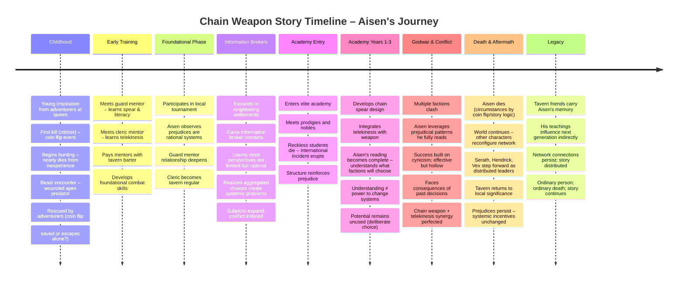

# Chain Weapon Story – Visual Timeline

Open this file in VS Code and press `Ctrl+Shift+V` to see the Mermaid diagram rendered.

---

## Story Arc Breakdown

### **Act 1: Foundations (Chapters 1–7)**
- **Length**: 15 scenes
- **Focus**: Childhood inspiration, mentorship, foundational skills
- **Tone**: Wonder → Survival → Growth
- **Key Theme**: Ordinary kid learns from ordinary mentors

### **Act 2: Understanding (Chapters 8–17)**
- **Length**: 40 scenes
- **Focus**: Expanding perspective, recognizing patterns, academic challenge
- **Tone**: Hope → Realization → Disillusionment
- **Key Theme**: Prejudice is rational system-preservation

### **Act 3: Action (Chapters 18–25)**
- **Length**: 32 scenes
- **Focus**: Godwar, leveraging systems, death, aftermath
- **Tone**: Pragmatism → Cynicism → Legacy
- **Key Theme**: Understanding systems doesn't grant power to change them

---

## Key Story Beats (Randomized by Coin Flip)

- **Robber Outcome**: Dies or Escapes?
- **Beast Rescue**: Saved by Party or Escapes Alone?
- **Guard Mentor**: Agrees to Teach or Refuses?
- **Academy Survival**: Luck or Caution?
- **Aisen's Death**: When, How, Circumstances?

Each flip is recorded; the author writes HOW each outcome manifests narratively.

---

## Timeline Reference

| Phase | Chapters | Scenes | Est. Words | Focus |
|-------|----------|--------|-----------|-------|
| Foundations | 1–7 | 15 | 30,000–37,500 | Childhood → Academy entry |
| Understanding | 8–17 | 40 | 100,000–140,000 | Academy → conflict realization |
| Action | 18–25 | 32 | 96,000–128,000 | Godwar → Death → Aftermath |
| **TOTAL** | **25** | **87** | **226,000–305,500** | Complete narrative |

---

**Remember**: The timeline is flexible. Coin flips determine key events. The author writes the how, not the what.
